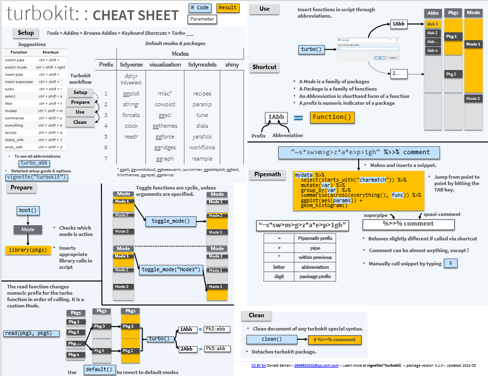

# turbokit

> turbokit

# 

# Overview

Turbokit introduces a set of tools for quickly inserting functions, function chains and reducing redundancy in formatting tasks. Heavily reduce keypresses and speed up frequent tasks.

-   `turbo()` inserts a function call in the active document using abbreviations. Abbreviations are flexible. Works without attaching packages in which functions live. Works without attaching the turbokit package.

-   `read()` and `boot()` provide quick setup to give the data science workflow a jumpstart. Specify a set of shortcuts and get the appropriate library calls.

<!-- -->

-   `%>>%` superpipe operator translates a complex pipe statement into full length snippets

-   `insert_pipe()` inserts the appropriate pipe (`%>>%` or `+`) based on document context. Usable from within function brackets. Gone are keypresses for redundant formatting.

-   Keyboard shortcuts for core functions, as well as frequently used dplyr functions. Extremely fast code input.

`vignette("chaining")`

`vignette("turbo")`

# Installation

`devtools::install_github("D-se/turbokit")`

# Setup

To get the most out of the package, it is recommended to bind shortcuts to key functions.

*Tools \> Addins \> Browse Addins \> Keyboard Shortcuts \> Turbo \_\_*

-   Insert the shortcut you want for a given function

-   Click "Apply"

    Note that addin shortcuts will overwrite existing shortcuts - therefore, it is recommended to bind a three-key combination. For recommended shortcuts, see `vignette("turbokit")`.

# Cheat Sheet

