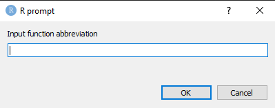

This vignette explains in detail each of these features.

-   Using turbo

    -   Mode

    -   Default bindings

    -   Special bindings

    -   User-defined functions

    -   Custom prefix

# Using turbo

The `turbo` function is the main function of the turbokit package. It inserts a function call into the active document. `turbo` does not require the turbokit package to be loaded to work. It is designed to be called via shortcut. When called, a input box is prompted.



Each call to the `turbo` function expects a description of a function in shorthand notation. This notation is a **prefix** followed by the lowercase **first** letter of each **snake case** part of the snake case version of a function name. Depending on the **mode** the user is in, each notation results in a function call in the document. This document can be R script, console, markdown file et cetera.

Regular snake case

```{r, eval=FALSE}
str_detect()
```

the user types 2*sd* in the prompt when in mode *tidyverse*

For camel case,

```{r, eval=FALSE}
reactiveValues()
```

*rv* in the prompt when in mode *shiny*

Dot notation,

```{r, eval=FALSE}
is.character()
```

*ic* in the prompt.

Where does the 2 in *2sd* come from? This 2 is a prefix. Without a prefix, turbokit would quickly run out of unique letter combinations. These prefixes are allocated when a new package is added to the search tree of `turbo`. These prefixes are adjustable to user preference, see the custom prefix section.

The `turbo` function in some cases, attempts to guess a function the user wants in case there is a typo, but no other functions with similar naming structure and similar length, exists in the package.

## Mode

The purpose of modes is to keep the prefixes low and segment functions. It serves to prevent cases such as `16rv` which would call `reactiveValues` from the shiny package while the user is doing some tidyverse piping.

```{r echo=FALSE, message=FALSE, warning=FALSE, results='asis'}
tabl <- "
| mode       | description |
|---------------|:-------------:|
| tidyverse     | opinionated data science packages  |
| visualisation     | add on packages to ggplot2 |
| tidymodels     | packages in modelling framework |
| shiny     | packages for creating interactive applications |
| dev     | packages for developing packages |
"
cat(tabl)
```

`toggle_mode` function is used to switch between modes. However, a shortcut is available that cycles through the modes so no typing has to be done.

```{r, eval=FALSE}
toggle_mode("shiny")
```

The "dev" mode is an exception, this can only be set by directly calling `toggle_mode("dev")`.

## Default prefixes

To find all the up-to-date abbreviations and their complete calls, refer to the `turbokit_abb` dataset that comes with the package. It is too long to mention in this vignette, as of release, there are 1500 functions available.

Each mode has its own exemption to prefixes. That is, a curated list of functions used very frequently in that mode is available without prefix call. The exemptions are still available using the default prefix, but have a copy available without prefix. These exemptions may change over time, as users provide feedback.

A list of the prefixes

```{r echo=FALSE, message=FALSE, warning=FALSE, results='asis'}
tabl <- "
| mode       | prefix | package 
|---------------|:-------------:|:-------------:|
| default     | none  | turbokit|
| default     | 0  | none|
| tidyverse     | 1  |ggplot|
| tidyverse     | 2 | stringr|
| tidyverse     | 3 | forcats|
| tidyverse     | 4 | clock|
| tidyverse     | 5 | readr|
| tidymodels      | 1 | recipes|
| tidymodels      | 2 | parsnip|
| tidymodels      | 3 | tune|
| tidymodels      | 4 | dials|
| tidymodels      | 5 | yardstick|
| tidymodels      | 6 | workflow|
| tidymodels      | 7 | rsample|
| shiny      |  none | shiny |
| visualisation |  1    | ggalt, ggfortify, ggrepel, ggfittext, ggsignif, ggbeeswarm, ggstance, ggwordcloud, ggalluvial, ggtext, hrbrthemes, ggstatsplot, survminer|
| visualisation       | 2  | cowplot|
| visualisation       | 3  | ggsci|
| visualisation       | 4  | ggthemes|
| visualisation       | 5  | ggforce|
| visualisation       | 6  | ggridges|
| visualisation       | 7  | ggraph|
| visualisation       | 8  | scales|
| dev       | 1  | usethis|
| dev       | 2  | testthat|
"
cat(tabl)
```

## Special bindings

Several special bindings are available as shortcuts for the turbokit package. These are different from regular functions, as they execute the function or prepare.

```{r echo=FALSE, message=FALSE, warning=FALSE, results='asis'}
tabl <- "
| abbreviation       | package | description 
|---------------|:-------------:|:-------------:|
| boot     | turbokit  | inserts library calls|
| >     | turbokit  | boots turbokit and inserts library calls of mode|
| <     | turbokit  | cleans turbokit specific syntax in script |
| boot     | turbokit  | boots turbokit and inserts library calls of mode|
| clean     | turbokit  | cleans turbokit specific syntax in script |
| !     | turbokit  | inserts read call in document|
| @     | turbokit  | resets turbo function defaults |
"
cat(tabl)
```

## User-defined functions

Functions defined in the current R session are a special case. User defined functions can be input by prefix "0", zero.

```{r}
my_func <- function(x){
    x+1
}
```

These are available regardless of the mode.

## Custom prefix

Users can adjust the default shortcut prefixes by using a function similar to a library call to attach functions, namely, `read`.

Custom prefixes are discarded on exiting an R session. To permanently set custom prefixes, users can add a line to their .Rprofile file.

An example of changing the default prefix is

```{r, eval=FALSE}
read(scales, 1)
```

Which inserts the shortcuts of the scales package at position 1, meaning that each function of the scales now is called via the `turbo` function with prefix 1. Up to 9 slots are available. Note that adding one custom function overwrites the defaults, which will not be available then. In a future update, shifting of the defaults so they remain available, will be added.

```{r, eval=FALSE}
read(scales, 1)
```

To revert back to default settings without exiting the R session,

```{r, eval=FALSE}
default()
```
